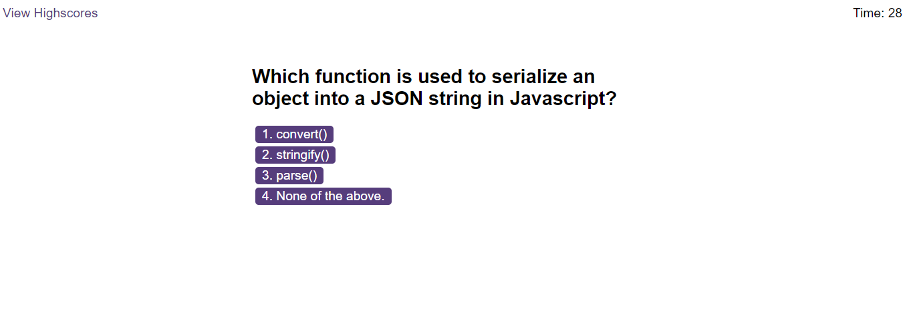

# JavaScript-Coding-Quiz

This project is a timed quiz based on coding questions from JavaScript.

## Description

JavaScript-Coding-Quiz project is a web application that presents the user with different coding questions based on JavaScript, saves the user's scores and displays the scores in a highscores list. This project modifies starter code, runs in the browser, and uses JavaScript to dynamically update HTML and CSS. It is responsive and adapts to multiple screen sizes.

## Screenshot

## Link to website

[JavaScript-Coding-Quiz](https://obeeyoma.github.io/JavaScript-Coding-Quiz/)
